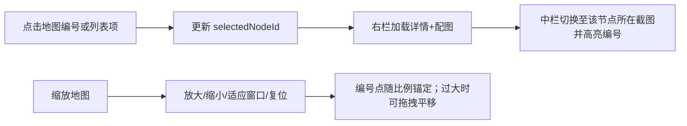

# 流放之路2 剧情流程辅助网页 — 产品设计文档（PRD）

| 文档版本 | v0.2 |
|----------|------|
| 更新日期 | 2026-05-25 |
| 产品代号 | Poe2Storyguide |
| 状态 | 草案 / 待评审 |

---

## 1. 产品目标

### 1.1 愿景

为《流放之路 2》（Path of Exile 2）剧情战役玩家提供**低干扰、高可读**的流程辅助工具，让玩家在游玩过程中能快速确认「我在哪 → 该做什么 → 做完去哪」，减少查攻略、记任务、漏支线的时间成本。

### 1.2 业务目标（MVP 阶段）

| 目标 | 说明 | 可衡量指标（上线后） |
|------|------|----------------------|
| **降低认知负担** | 用结构化步骤替代长篇文字攻略 | 单次查询停留 &lt; 30s 即可完成决策 |
| **支持边玩边查** | 适配第二屏 / 手机竖屏 / 小窗 | 移动端占比、会话时长分布 |
| **进度可延续** | 记住当前章节与节点，换设备可恢复（可选） | 7 日回访率、进度完成率 |
| **内容可维护** | 数据与 UI 分离，便于随版本补丁更新 | 单次内容更新不涉及改布局代码 |

### 1.3 非目标（MVP 不做）

- 全职业 BD、装备词缀、市集价格等「构筑向」内容
- 实时游戏内数据对接（无官方 API 前提下不做自动同步任务状态）
- 社区 UGC、评论、投票（后续版本考虑）
- 多语言（MVP 以简体中文为主，结构预留 i18n）

### 1.4 目标用户

- **主线推进型**：首次或速通战役，需要清晰主线顺序
- **查漏补缺型**：担心漏支线、漏神像/技能点，需要清单式核对
- **回归玩家**：隔段时间继续玩，需要快速回忆当前进度

---

## 2. 用户使用场景（边玩边查）

### 2.1 典型场景矩阵

| 场景 | 环境 | 用户状态 | 核心诉求 | 产品响应 |
|------|------|----------|----------|----------|
| **S1 第二屏速查** | PC + 手机/平板放侧边 | 战斗中或跑路中，余光扫一眼 | 「下一步去哪、找谁」 | 大号「当前步骤」+ 一键下一步 |
| **S2 全屏暂停查** | Alt+Tab 到浏览器 | Boss 前、卡关、选分支 | 看清前置条件、奖励、可选支线 | 步骤详情展开 + 地图锚点 |
| **S3 手机竖屏** | 单手持机 | 沙发游玩、无第二屏 | 拇指区操作、少滚动 | 底部固定操作栏 + 折叠次要信息 |
| **S4 断点续玩** | 隔天打开 | 忘记进度 | 「从上次继续」 | 本地/账号进度恢复 + 章节摘要 |
| **S5 漏任务自查** | 进新章节前 | 想确认本章是否清干净 | 本章 checklist | 节点完成态 + 可选支线标记 |

### 2.2 边玩边查的设计原则

1. **3 秒法则**：默认视图必须在 3 秒内回答「下一步是什么」。
2. **单手优先**：关键操作集中在屏幕下方 1/3（下一步、上一步、标记完成）。
3. **少输入**：MVP 以点击为主，避免搜索框成为主路径（搜索作为辅助入口）。
4. **弱网可用**：静态数据 + 本地进度，首屏可缓存（PWA 可选）。
5. **防剧透分级**：默认只显示当前及已完成节点；未解锁章节仅显示标题（可选设置「显示全部」）。

### 2.3 用户旅程（简图）

```
开始游玩 → 打开辅助页 → 选择/恢复章节
    → 在固定主线序列中点击「我认为的当前节点」（或沿用上次进度）
    → 右侧查看该节点详情（文字 + 配图）→ 游戏中完成该节点
    → 点击「下一步」沿固定顺序进入下一节点
    → 需要查漏时点击「上一步」或点选更早的节点复查
    → 循环直至章节结束 → 进入下一章
```

**核心假设**：每章有一条**预先编排好的固定主线顺序**（Flow），用户进度以「当前指针」在该序列上的位置为主，而非自由跳跃任务树。

---

## 3. 核心功能（MVP 版本）

### 3.1 功能清单与优先级

| 优先级 | 功能 | 描述 | MVP |
|--------|------|------|-----|
| P0 | **固定主线 Flow** | 每章预置唯一节点顺序；进度沿该顺序推进 | ✅ |
| P0 | **章节导航** | 左侧 Act 1 / Act 2…，显示完成进度 | ✅ |
| P0 | **地图视图** | 游戏地图截图 + 编号节点，与截图坐标对应 | ✅ |
| P0 | **地图缩放** | 中间地图区支持放大/缩小（及复位） | ✅ |
| P0 | **用户指定当前节点** | 用户可点击任意已开放节点设为「当前」 | ✅ |
| P0 | **下一步 / 上一步** | 沿固定 Flow 前进或回退节点（游戏每过一节点点一次下一步） | ✅ |
| P0 | **节点详情（含图）** | 右侧展示说明、步骤、**配图**（地点/NPC/掉落示意等） | ✅ |
| P0 | **进度本地保存** | 记录当前指针、已完成节点集合、选中节点 | ✅ |
| P1 | **节点清单** | 与 Flow 同序的列表；悬浮/点击联动地图 | ✅ |
| P1 | **编号悬浮摘要** | 地图上 hover 显示节点要点 | ✅ |
| P1 | **可选支线** | 挂在固定 Flow 侧枝，可跳过 | ✅ |
| P2 | **搜索** | 按地名、NPC、任务关键词定位节点 | 可选 |
| P2 | **设置** | 剧透开关、字体大小、深色模式 | 可选 |
| P3 | **云同步 / 账号** | 跨设备进度 | 不做 |

### 3.2 MVP 功能边界说明

- **内容范围**：覆盖主线战役流程；重要可选内容以「可选节点」类型标注，不追求 100% 收集品数据库。
- **地图表现**：中间区域使用**游戏地图截图**（或合规替代图），编号点按百分比坐标锚定在截图上；支持缩放平移以便对照。
- **推进粒度**：**「下一步」默认按「节点」推进**（游戏内完成一个节点 → 网站点一次下一步）；节点内部的步骤与配图供阅读，不作为强制逐步解锁条件（除非内容标注为多步 Boss 等特殊情况）。
- **更新机制**：内容通过 JSON/YAML 数据包更新，版本号写入 `contentVersion`。

---

## 4. 页面结构

### 4.1 站点地图（MVP）

```
/                          首页（继续进度 + 章节入口）
/chapter/:chapterId        章节工作台（核心页）
  ├─ 视图：地图 | 列表 | 步骤（Tab 或分栏，见 5.2）
/node/:nodeId              节点详情（可从章节页 deep link，MVP 可与章节页合并为抽屉）
/settings                  设置（P2）
/about                     版本、免责声明、内容来源
```

### 4.2 页面线框说明

#### 4.2.1 首页 `/`

| 区域 | 内容 |
|------|------|
| 顶栏 | Logo、设置入口 |
| 主 CTA | **继续剧情**（显示：第 X 章 · 当前节点名 · 步骤 n/m） |
| 章节网格 | 各章卡片：标题、进度环、锁定/进行中/已完成状态 |
| 底栏 | 内容版本、反馈链接（可选） |

#### 4.2.2 章节工作台 `/chapter/:chapterId`（核心）

采用 **「左章节 · 中地图 · 右详情」** 三栏布局（桌面 ≥1024px）。

| 区域 | 桌面 | 移动 |
|------|------|------|
| **左栏** | Act 1 / Act 2… + 与固定 Flow 同序的节点列表 | 抽屉或 Tab「章节」 |
| **中栏** | 游戏地图截图 + 编号点；**缩放工具条**（放大/缩小/适应/复位） | 可全屏展开地图；双指缩放 |
| **右栏** | 节点详情：**下一步提示**、文字说明、**配图区**、「上一步」「下一步」 | 底部抽屉；配图可点击放大 |
| **顶栏** | 章节名、Flow 进度（如 8/24）、返回首页 | 同左 |

**右栏配图要求**：每个节点至少支持 0～N 张关联图（节点头图、步骤图）；图片需适配窄栏宽度，支持懒加载与点击全屏预览。

#### 4.2.3 设置页 `/settings`（P2）

- 剧透：仅显示当前章 / 显示全部
- 外观：浅色 / 深色 / 跟随系统
- 字号：标准 / 大
- 清除本地进度（二次确认）

### 4.3 响应式断点建议

| 断点 | 布局策略 |
|------|----------|
| &lt; 640px | 单栏；地图默认折叠；底栏固定 |
| 640–1024px | 地图与步骤上下堆叠；列表为 Tab |
| ≥ 1024px | 左 20% 章节+列表，中 45% 地图（可缩放），右 35% 详情+配图+操作 |

---

## 5. 交互流程（重点）

### 5.1 固定 Flow 与用户进度

每章维护一条**固定主线序列** `flowOrder: string[]`（节点 id 数组），全站内容编排时确定，用户端只读。

用户进度在客户端维护：

```
ChapterState:     locked | in_progress | completed
flowIndex:        0 .. (flowOrder.length - 1)   // 当前指针：认为进行到哪一节
selectedNodeId:   string                        // 用户正在查看的节点（可与指针不同）
completedNodeIds: Set<string>                  // 已点「下一步」离开过的节点
viewMode:         following | reviewing         // 跟随指针 | 查阅历史节点
```

**规则（MVP）：**

| 概念 | 含义 |
|------|------|
| **flowIndex** | 固定 Flow 上的「当前进度指针」；点「下一步」时 `+1` 并标记上一节点完成；点「上一步」时 `-1`（用于查漏，不自动抹掉已完成标记，除非用户确认「撤销此后进度」） |
| **selectedNodeId** | 用户点击地图/列表任意节点时更新；用于右栏详情与配图 |
| **设为当前** | 用户点击某节点后可选「这就是我现在所在的节点」→ 将 `flowIndex` 对齐到该节点在 `flowOrder` 中的下标 |
| **已完成** | 凡 `flowIndex` 已超过的节点，或用户曾对其点过「下一步」离开的节点 |

可选支线节点**不在** `flowOrder` 中，或标记为 `optional`；跳过不影响 `flowIndex` 主线指针。

### 5.2 全局状态机（节点展示态）

```
NodeDisplayState（派生）:
  completed   // 索引 < flowIndex 或 id ∈ completedNodeIds
  current     // flowOrder[flowIndex] === nodeId
  upcoming    // 索引 > flowIndex
  optional    // 支线，单独样式
```

不再强调「未解锁不可点」：MVP 允许用户点选 Flow 内**任意节点**查看详情（剧透模式关闭时，可限制仅查看 flowIndex 及之前节点，见设置）。

### 5.3 核心流程 1：首次进入

```mermaid
flowchart TD
    A[打开首页] --> B{本地有进度?}
    B -->|否| C[展示章节网格 第1章可用]
    B -->|是| D[展示「继续剧情」主按钮]
    C --> E[用户点击第1章]
    D --> F[用户点击继续]
    E --> G[进入章节工作台]
    F --> G
    G --> H[flowIndex = 0 或恢复存档]
    H --> I[selectedNodeId = flowOrder[flowIndex]]
    I --> J[中栏地图高亮 + 右栏详情与配图]
```

### 5.4 核心流程 2：边玩边查主循环（节点级下一步）

```mermaid
flowchart TD
    A[章节工作台] --> B[右栏阅读当前节点详情与配图]
    B --> C{游戏内完成该节点?}
    C -->|是| D[点击「下一步」]
    C -->|否| E[中栏缩放地图对照 / 看配图]
    E --> B
    D --> F[当前节点记入 completed；flowIndex++]
    F --> G[selectedNodeId = flowOrder[flowIndex]]
    G --> H[右栏切换下一节点详情；地图编号联动]
    H --> B
```

**交互细节：**

- **「下一步」**：沿 `flowOrder` 前进一个节点；主按钮高对比；快捷键 `→` / `N`。
- **「上一步」**：`flowIndex--`，用于**查漏补缺**；右栏与地图切换到上一节点；**默认不**清除该节点及之后节点的「已完成」标记；若用户回退后重新点「下一步」，从当前指针继续覆盖式推进（可选二次确认：「是否撤销之后节点的完成状态？」）。
- **用户点选节点**：更新 `selectedNodeId` 与右栏（含配图）；若与 `flowIndex` 不一致，进入 `reviewing` 模式，右栏显示「返回当前进度」。
- **「设为我的当前节点」**：将 `flowIndex` 设为该节点下标（纠偏：游戏进度快于/慢于网站记录时）。
- 进度变化写入 localStorage（防抖 300ms）。

### 5.5 核心流程 3：地图 / 列表 / 缩放



- **地图缩放**：工具条 `+` / `-` / `适应` / `100%`；滚轮+Ctrl 缩放（桌面）；触屏双指缩放。
- **查阅历史节点**：允许；不改变 `flowIndex`，直至用户点「返回当前进度」或「设为我的当前节点」。

### 5.6 核心流程 4：断点续玩

1. 首页读取 `currentChapterId`、`flowIndex`、`selectedNodeId`。
2. 「继续剧情」恢复三栏：左栏 Act、中栏对应截图与编号、右栏节点详情与配图。
3. `contentVersion` 变更时按 `flowOrder` 与 `nodeId` 做迁移（见 §7.4）。

### 5.7 异常与边界交互

| 情况 | 行为 |
|------|------|
| 用户误点「下一步」 | 「上一步」回退指针；已完成集合可选撤销（仅后续未再前进时） |
| 游戏进度超前于网站 | 用户点击实际所在节点 →「设为我的当前节点」 |
| 游戏进度落后 | 用户「上一步」或点选较早节点复查，不强制改指针 |
| 配图缺失 | 占位图 + 文字说明；不阻断「下一步」 |
| 地图过大 | 默认「适应宽度」；用户自行放大 |

### 5.8 关键微交互

- 节点完成：列表打勾 + 地图编号勾选；`flowIndex` 节点脉冲高亮。
- 右栏配图：懒加载；点击 Lightbox 全屏；切换节点时配图区淡入切换。
- 地图缩放：缩放后编号点位置不变（相对截图百分比锚定）。
- 触觉反馈（移动端）：「下一步」「上一步」可选轻震动。

---

## 6. 信息结构（章节 / 地图 / 节点 / 步骤）

### 6.1 层级定义

```
Campaign（战役）
 └── Chapter（章节 / 幕）          例：第一章、第二章
      └── Map（地图/区域）          例：克利夫兰、森林区 — 逻辑分组，可对应多张示意图
           └── Node（节点/任务）    例：与 NPC 对话、击杀 Boss、放置物品
                └── Step（步骤）     例：前往坐标、杀 3 只怪、回程交任务
```

### 6.2 实体属性（逻辑模型）

#### Chapter 章节

| 字段 | 说明 |
|------|------|
| `id` | 稳定标识，如 `act1` |
| `title` | 显示名 |
| `order` | 排序 |
| `summary` | 一句话本章目标 |
| `maps[]` | 关联地图 id 列表 |
| `flowOrder[]` | **固定主线顺序**（节点 id 数组，权威推进顺序） |
| `nodes[]` | 本章全部节点定义 |
| `optionalNodes[]` | 可选节点 id（可不在 flowOrder 中） |

#### Map 地图

| 字段 | 说明 |
|------|------|
| `id` | 如 `act1_zone_forest` |
| `chapterId` | 所属章节 |
| `title` | 区域名 |
| `image` | 游戏地图截图 URL |
| `defaultZoom` | 可选：默认缩放比例或 `fit` |
| `markers[]` | 编号锚点：`{ nodeId, label, x, y }` 百分比中心坐标 |

#### Node 节点

| 字段 | 说明 |
|------|------|
| `id` | 如 `act1_marooned_talk_captain` |
| `chapterId` | 所属章 |
| `mapId` | 主要发生地图 |
| `type` | `main` \| `optional` \| `boss` |
| `title` | 节点标题 |
| `prerequisites[]` | 前置节点 id |
| `rewards` | 文本：经验、技能点、物品等 |
| `coverImage` | 节点头图（右栏顶部） |
| `images[]` | 节点级配图列表 `{ url, caption, order }` |
| `steps[]` | 说明步骤（阅读用，非强制逐步解锁） |

#### Step 步骤

| 字段 | 说明 |
|------|------|
| `id` | 稳定 id |
| `nodeId` | 所属节点 |
| `order` | 序号 |
| `title` | 短标题（卡片主文案） |
| `body` | 详细说明（Markdown 子集） |
| `image` | 可选：该步骤配图 URL |
| `imageCaption` | 配图说明 |
| `location` | 可选：地点关键词，用于地图联动高亮 |
| `tags[]` | 如 `combat`, `talk`, `loot`, `waypoint` |

### 6.3 信息架构示意

```
战役
├── 第一章 [in_progress 60%]
│   ├── 地图 A
│   │   ├── 节点1 (main) ✓
│   │   └── 节点2 (main) ● 当前
│   ├── 地图 B
│   │   └── 节点3 (boss) ○ 锁定
│   └── 可选
│       └── 节点X (optional) ○
└── 第二章 [locked]
```

### 6.4 内容标注规范（供编辑）

- **flowOrder** 一经发布尽量少改顺序；若必须调整需升 `contentVersion` 并提供进度迁移说明。
- 每个 **Step** 描述宜为**单一动作**，并尽量配一张图（截图圈点/NPC 头像/门牌示意）。
- **Node** 粒度：对齐游戏内「过一个节点」的节奏，与网站「下一步」一次推进对齐。
- **可选节点** 必须标注「可选」，且不插入主线 `flowOrder`（或明确标记为侧枝）。

---

## 7. 数据如何组织（建议结构）

### 7.1 文件拆分建议

```
content/
  manifest.json          # 内容版本、章节索引
  chapters/
    act1.json
    act2.json
  maps/
    act1_forest.json
  nodes/
    act1_*.json          # 或按章合并进 chapter 文件
  media/
    maps/act1_forest.svg
```

**MVP 简化方案**：每章一个 JSON，内嵌 maps、nodes、steps，减少请求数。

### 7.2 章节文件示例（`content/chapters/act1.json`）

```json
{
  "id": "act1",
  "title": "第一章",
  "order": 1,
  "summary": "海难后求生，抵达第一个营地",
  "flowOrder": ["act1_intro", "act1_camp"],
  "maps": [
    {
      "id": "act1_shore",
      "title": "海难海岸",
      "image": "/media/maps/act1_shore.jpg",
      "defaultZoom": "fit",
      "markers": [
        { "nodeId": "act1_intro", "label": "1", "x": 12, "y": 40 }
      ]
    }
  ],
  "nodes": [
    {
      "id": "act1_intro",
      "mapId": "act1_shore",
      "type": "main",
      "title": "醒来与探索",
      "coverImage": "/media/nodes/act1_intro_cover.jpg",
      "images": [
        { "url": "/media/nodes/act1_intro_1.jpg", "caption": "沿海岸向北", "order": 1 }
      ],
      "rewards": "",
      "steps": [
        {
          "id": "act1_intro_s1",
          "order": 1,
          "title": "向前探索找到幸存者",
          "body": "沿海岸前进，触发剧情对话。",
          "image": "/media/nodes/act1_intro_s1.jpg",
          "location": "海岸入口",
          "tags": ["talk"]
        }
      ]
    }
  ],
  "optionalNodes": []
}
```

### 7.3 清单索引（`content/manifest.json`）

```json
{
  "contentVersion": "0.1.0",
  "gameVersion": "poe2-0.x.x",
  "updatedAt": "2026-05-25",
  "chapters": [
    { "id": "act1", "title": "第一章", "order": 1, "file": "chapters/act1.json" }
  ]
}
```

### 7.4 用户进度（`localStorage`：`poe2storyguide_progress`）

```json
{
  "contentVersion": "0.1.0",
  "updatedAt": "2026-05-25T12:00:00Z",
  "currentChapterId": "act1",
  "flowIndex": 3,
  "selectedNodeId": "act1_camp",
  "completedNodeIds": ["act1_intro", "act1_shore", "act1_woods"],
  "chapters": {
    "act1": {
      "state": "in_progress",
      "flowIndex": 3,
      "completedNodeIds": ["act1_intro", "act1_shore", "act1_woods"]
    }
  },
  "mapView": {
    "act1_shore": { "zoom": 1.2, "panX": 0, "panY": -40 }
  },
  "settings": {
    "spoilerMode": "current_chapter_only",
    "theme": "system",
    "fontSize": "normal"
  }
}
```

### 7.5 运行时聚合（前端）

建议用轻量 **状态 store**（如 Zustand / Pinia）：

| Store 切片 | 来源 |
|------------|------|
| `content` | 异步加载 manifest + 当前章 JSON |
| `progress` | 读写在 localStorage |
| `ui` | 地图缩放、平移、右栏 Lightbox、抽屉开关 |

**派生数据（selectors）：**

- `currentFlowNode` = `flowOrder[flowIndex]`
- `nextFlowNode` = `flowOrder[flowIndex + 1]`
- `prevFlowNode` = `flowOrder[flowIndex - 1]`
- `chapterPercent` = `flowIndex / flowOrder.length`（或按 `completedNodeIds` 计数）
- `isReviewing` = `selectedNodeId !== currentFlowNode`

### 7.6 内容版本迁移

当 `contentVersion` 变化时：

1. 对比 `manifest.chapters` 与旧进度中的 `nodeId`。
2. 若节点被删除/合并：标记 `orphaned`，提示用户手动定位。
3. 若 `flowOrder` 重排：按 `nodeId` 匹配最接近的下标并提示用户确认。
4. 本地 `mapView` 缩放状态可丢弃，不阻断恢复。

### 7.7 TypeScript 类型（实现参考）

```typescript
type NodeType = 'main' | 'optional' | 'boss';
type ProgressState = 'locked' | 'available' | 'in_progress' | 'completed' | 'skipped';

interface Step {
  id: string;
  order: number;
  title: string;
  body?: string;
  image?: string;
  imageCaption?: string;
  location?: string;
  tags?: string[];
}

interface NodeImage {
  url: string;
  caption?: string;
  order?: number;
}

interface Node {
  id: string;
  mapId: string;
  type: NodeType;
  title: string;
  coverImage?: string;
  images?: NodeImage[];
  rewards?: string;
  steps: Step[];
}

interface MapMarker {
  nodeId: string;
  label: string;
  x: number;
  y: number;
}

interface Chapter {
  id: string;
  title: string;
  order: number;
  summary?: string;
  flowOrder: string[];
  maps: MapDef[];
  nodes: Node[];
  optionalNodes?: string[];
}
```

---

## 8. 技术栈建议（非 PRD 必需，供评审参考）

| 层级 | 建议 | 理由 |
|------|------|------|
| 框架 | Vite + React 或 Vue 3 | 静态部署简单、生态成熟 |
| 样式 | Tailwind CSS | 快速响应式与深色模式 |
| 路由 | 文件路由或 React Router | 章节 deep link |
| 部署 | GitHub Pages / Cloudflare Pages | 纯静态、零后端成本 |
| 可选 | PWA | 离线缓存内容包 |

---

## 9. 里程碑建议

| 阶段 | 交付物 |
|------|--------|
| M0 | PRD 评审通过 + 第一章样例数据 10 个节点 |
| M1 | 三栏工作台 + 固定 Flow + 下一步/上一步 + 本地进度 |
| M2 | 地图截图编号 + 缩放 + 右栏配图 + 首页继续 |
| M3 | 全章节内容填充 + 设置 + 移动端打磨 |
| M4 | PWA、搜索、内容后台（可选） |

---

## 10. 风险与合规

- **免责声明**：非官方工具，内容可能与补丁不一致，页面需注明。
- **版权**：节点详情配图与地图截图需确认合理使用范围；必要时使用自制标注图替代全屏截图。
- **剧透**：默认保守策略，减少新玩家被误剧透的投诉。

---

## 附录 A：名词对照

| 中文 | 英文标识 | 说明 |
|------|----------|------|
| 章节 | Chapter | 战役「幕」 |
| 地图 | Map | 区域示意图层 |
| 节点 | Node | 任务/事件单元 |
| 步骤 | Step | 节点内说明条目（可配图，非强制逐步解锁） |
| 固定流程 | Flow / flowOrder | 章节内唯一主线推进顺序 |

---

## 附录 B：待确认问题（评审用）

1. MVP 覆盖到第几章？是否包含终局前的全部主线？
2. 节点配图来源规范（游戏截图裁剪 vs 自制标注）？
3. 「上一步」回退时是否默认撤销后续节点的已完成状态？
4. 进度是否要做账号同步（依赖登录）？
5. 内容由谁维护：手写 JSON 还是 Notion/表格导出？

---

*文档结束 — 下一步可基于本 PRD 输出技术方案（架构图、接口清单）与第一章内容大纲。*
